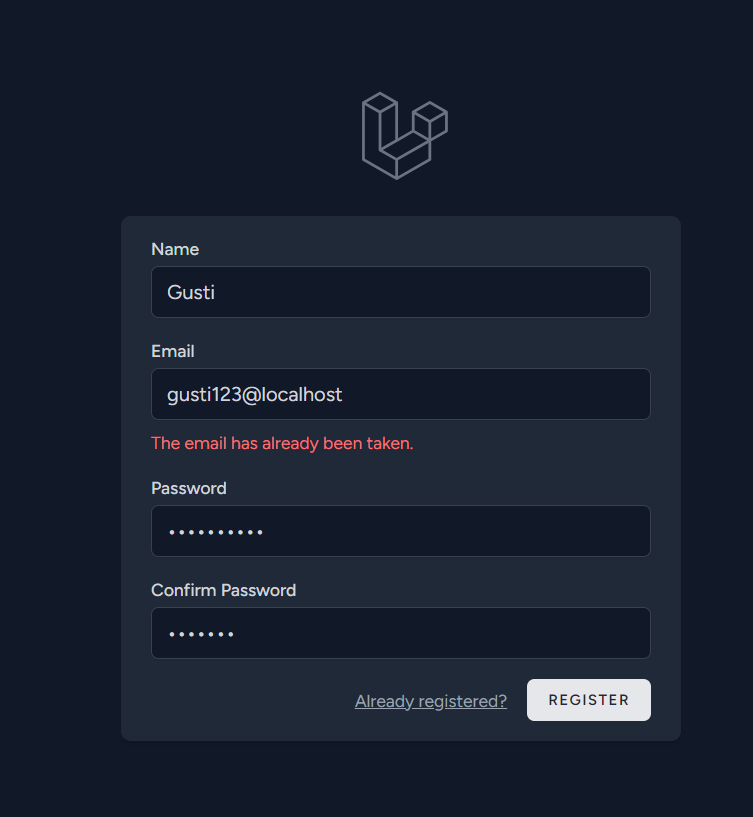
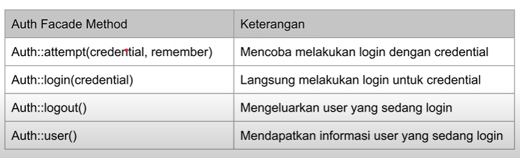

# LARAVEL SECURITY

## POINT UTAMA

### 1. Instalasi

-   Minimal PHP versi 8 atau lebih,

-   Composer versi 2 atau lebih,

-   Lalu pada cmd ketikan `composer create-project laravel/laravel=v10.2.9 belajar-laravel-security`.

---

### 2. Pengenalan

-   Laravel Security secara otomatis melindungi aplikasi dari serangan `CSRF` (Cross-Site Request Forgery) dengan menggunakan token `CSRF` pada setiap formulir yang dikirimkan. Token ini memverifikasi bahwa permintaan yang diterima oleh server berasal dari sumber yang sah.

-   Proteksi `XSS` (Cross-Site Scripting)
    Laravel melindungi aplikasi dari serangan XSS dengan secara otomatis meng-escape output yang diberikan dalam template Blade.

-   Proteksi SQL Injection
    Laravel menggunakan Eloquent ORM dan query builder yang secara otomatis menghindari SQL Injection dengan menggunakan binding parameter.

-   Hashing Password
    Laravel menyediakan mekanisme hashing password yang aman menggunakan `bcrypt` atau argon2 melalui _facade_ `Hash`.

---

### 3. User Model

-   User Model, digunakan sebagai Model untuk nanti kita melakukan `Authentication`,

-   Jika ingin mengubah informasi dari User Model, kita bisa mengubahnya sebelum menjalankan `migration`.

-   Buat database dengan nama `belajar_laravel_security`, lalu jalankan database migrate `php artisan migrate`.

-   Hasil dari perintah `php artisan migrate` bisa di lihat di folder `database/migrate`.

---

### 4. Laravel Breeze

-   Laravel Breeze adalah fitur sederhana untuk membuat halaman proses `authentication` secara otomatis,

-   Laravel Breeze mendukung halaman _registration_, _login_, _password reset_, _email verification_ dan _password confirmation_,

-   Laravel Breeze membuat halamannya menggunakan `Blaze Template`, dan menggunakan library `Tailwind CSS` untuk library CSS nya.

-   Dokumentasi: https://laravel.com/docs/11.x/starter-kits#laravel-breeze

-   Gunakan perintah `composer require laravel/breeze=v1.26.2 --dev` untuk menambahkan _library_ breeze ke project Laravel,

-   Setelah menambahkan breeze, gunakan perintah `php artisan breeze:install`, untuk menginstall seluruh halaman `authorization`.

-   Gunakan perintah `php artisan serve` untuk melihat tampilan yang sudah di update ketika menginstall Laravel Breeze.

    

-   Tampilan login Laravel Breeze

    

---

### 5. Authentication

-   Authentication adalah proses melakukan verifikasi apakah request dari User yang dikenali atau tidak,

-   Walaupun kita tahu bahwa data User disimpan di model User, namun untuk proses Authentication, kita tidak menggunakan langsung User Model, melainkan menggunakan _Facade_ `Auth`.

-   Auth Facade Method

    

-   Kode User Seeder

    ```PHP
     public function run(): void
    {
        User::create([
            "name" => "Gusti Akbar",
            "email" => "gusti@localhost",
            "password" => Hash::make("rahasia"),
            "token" => "secret"
        ]);
    }
    ```

-   Sebelum melakukan test hapus dulu semua data yang ada di tabel users

    ```PHP
    abstract class TestCase extends BaseTestCase
    {
        use CreatesApplication;

        protected function setUp(): void
        {
            parent::setUp(); // TODO: Change the autogenerated stub
            DB::delete("delete from users");
        }
    }
    ```

-   Kode Auth Test

    ```PHP
    public function testAuth() // test ketika user sudah login
    {
        $this->seed(UserSeeder::class);

        $success = Auth::attempt([
            "email" => "gusti@localhost",
            "password" => "rahasia"
        ], true);
        self::assertTrue($success);

        $user = Auth::user();
        self::assertNotNull($user);
        self::assertEquals("gusti@localhost", $user->email);
    }

    public function testGuest() // test ketika belum login atau tamu
    {
        $user = Auth::user();
        self::assertNull($user);
    }
    ```

---

### 6. User Session

-   Saat menggunakan `Auth::login()`, secara otomatis data user akan disimpan di Session,

-   Bisa juga melakukan generate session agar informasi user disimpan di `Cookie`,

Saat menggunakan `Auth::attempt()`, jika sukses, secara otomatis `Auth::login()` juga akan dipanggil.

-   Kode User Controller

    ```PHP
    public function login(Request $request)
    {
        $response = Auth::attempt([
            "email" => $request->query("email", "wrong"),
            "password" => $request->query("password", "wrong"),
        ]);

        if ($response) {
            Session::regenerate();
            return redirect("/users/current");
        } else {
            return "Wrong credentials";
        }
    }

    public function current()
    {
        $user = Auth::user();
        if ($user) {
            return "Hello $user->name";
        } else {
            return "Hello Guest";
        }
    }
    ```

-   Kode Route

    ```PHP
    Route::get("/users/login", [\App\Http\Controllers\UserController::class, "login"]);
    Route::get("/users/current", [\App\Http\Controllers\UserController::class, "current"]);
    ```

-   Kode Session Test

    ```PHP
    public function testLogin() // kode test untuk login
    {
        $this->seed([UserSeeder::class]);

        $this->get("/users/login?email=gusti@localhost&password=rahasia")
            ->assertRedirect("/users/current");

        $this->get("/users/login?email=salah&password=rahasia")
            ->assertSeeText("Wrong credentials");
    }

    public function testCurrent() // kode test current
    {
        $this->seed([UserSeeder::class]);

        $this->get("/users/current")
            ->assertSeeText("Hello Guest");

        $user = User::where("email", "gusti@localhost")->firstOrFail();
        $this->actingAs($user)
            ->get("/users/current")
            ->assertSeeText("Hello Gusti Akbar");
    }
    ```

---

### 7. Hash Facade

-   Saat membuat password di User Model, kita menggunakan `Hash Facade`,

-   `Hash Facade` digunakan untuk membuat _hash_, dan juga digunakan untuk melakukan pengecekan _hash_,

-   Secara default, _Hash_ di Laravel menggunakan algoritma `BCrypt`, saat kita menggunakan `Auth::attempt()`, kita tidak perlu melakukan _hash_ password lagi, karena otomatis pengecekan _hash_ nya dilakukan oleh Laravel,

-   Pengaturan _hash_ bisa dilakukan di file `config/hashing.php`.

-   Dokumentasi: https://laravel.com/api/10.x/Illuminate/Support/Facades/Hash.html

-   Kode Has Test

    ```PHP
    public function testHash()
    {
        $password = "rahasia";
        $hash = Hash::make($password);

        $result = Hash::check("rahasia", $hash);
        self::assertTrue($result);
    }
    ```

---

### 8. Auth Config

-   Laravel menyimpan seluruh konfigurasi di `Auth` di dalam file `config/atuh.php`, dan bisa saja di ubah jika diperlukan.

-   Secara default, Laravel akan membuat sebuah `middleware` bernama _Authenticate_,

-   `Middleware` ini bisa digunakan untuk memastikan bahwa User sudah ter-autentikasi terlebih dahulu sebelum mengakses halaman yang ingin diakses,

-   Bisa juga menggunakan _alias_ nya bernama auth
    Jika user belum melakukan autentikasi, `Middleware` akan mengembalikan _error_ _AuthenticationException_, dan secara default akan melakukan redirect ke route "login".

-   Kode Route

    ```PHP
    Route::get("/users/login", [\App\Http\Controllers\UserController::class, "login"]);
    Route::get("/users/current", [\App\Http\Controllers\UserController::class, "current"])
        ->middleware(["auth"]);
    ```

---

### 9. Guard

-   Guard adalah bagaimana cara User di autentikasi untuk tiap request nya, secara default, di file `config/auth.php`, caranya adalah menggunakan _session_, artinya proses autentikasi akan dilakukan dengan cara mengecek _session_,

-   Kadang, ada kasus kita ingin membuat Guard secara manual, contoh pada kasus kita ingin membuat API yang digunakan bukan untuk Web, misal kita ingin melakukan pengecekan melalui `API-Key` yang dikirim via header misalnya,

-   Coba membuat Guard untuk melakukan autentikasi terhadap token `API-Key`.

-   Kode Menambahkan Token di User Model

    ```PHP
       public function up(): void // buat didalam file migration
    {
        Schema::table('users', function (Blueprint $table) {
            $table->string("token", 200)->nullable();
        });
    }

    /**
     * Reverse the migrations.
     */
    public function down(): void
    {
        Schema::table('users', function (Blueprint $table) {
            $table->dropColumn("token");
        });
    }
    ```

-   Menambahkan Token di User Seeder

    ```PHP
    public function run(): void
    {
        User::create([
            "name" => "Gusti Akbar",
            "email" => "gusti@localhost",
            "password" => Hash::make("rahasia"),
            "token" => "secret" // token
        ]);
    }
    ```

-   Untuk membuat Guard, kita bisa membuat class turunan dari `interface Guard`,

-   Dan saat menggunakan Guard, biasanya kita akan menggunakan `UserProvider`, untuk mendapatkan detail dari informasi User nya,

-   Setelah membuat guard, kita bisa registrasikan Guard yang telah kita buat di _method_ `boot()` milik
    _class_ `AuthService Provider`, tambahkan ke `config/auth.php`.

-   Kode Guard

    ```PHP
    class TokenGuard implements Guard
    {
        use GuardHelpers;

        private Request $request;

        public function __construct(UserProvider $provider, Request $request){
            $this->provider = $provider;
            $this->request = $request;
        }

        public function setRequest(Request $request): void
        {
            $this->request = $request;
        }

        public function user()
    {
        if($this->user != null){
            return $this->user;
        }

        $token = $this->request->header("API-Key");
        if($token){
            $this->user = $this->provider->retrieveByCredentials(["token" => $token]);
        }
        return $this->user;
    }

    public function validate(array $credentials = [])
    {
        return $this->provider->validateCredentials($this->user, $credentials);
    }
    }
    ```

-   kode Registrasi Guard

    ```PHP
    public function boot(): void
    {
        Auth::extend("token", function (Application $app, string $name, array $config) {
            $tokenGuard = new TokenGuard(Auth::createUserProvider($config["provider"]), $app->make(Request::class));
            $app->refresh("request", $tokenGuard, "setRequest");
            return $tokenGuard;
        });
    }
    ```

-   Tambahkan di config/auth.php

    ```PHP
    'guards' => [
        "token" => [
            "driver" => "token",
            "provider" => "users"
        ],
    ]
    ```

-   kode Route Guard

    ```PHP
    Route::get("/api/users/current", [\App\Http\Controllers\UserController::class, "current"])
    ->middleware(["auth:token"]);
    ```

-   Kode Unit Test Guard

    ```PHP
      public function testTokenGuard()
    {
        $this->seed([UserSeeder::class]);

        $this->get("/api/users/current", [
            "Accept" => "application/json"
        ])
            ->assertStatus(401);

        $this->get("/api/users/current", [
            "Accept" => "application/json",
            "API-Key" => "secret"
        ])
            ->assertSeeText("Hello Gusti Akbar");
    }
    ```

---

### 10. User Provider

-   Secara default, di `config/auth.php`, informasi User akan diambil menggunakan Eloquent UserProvider,

-   User Provider menggunakan kontrak interface dari UserProvider, defaultnya, menggunakan Eloquent UserProvider,

-   UserProvider biasanya digunakan oleh Guard untuk mengambil informasi User

-   Dokumentasi: https://laravel.com/api/10.x/Illuminate/Contracts/Auth/UserProvider.html

-   Kode Simple User Provider

    ```PHP
    class SimpleProvider implements UserProvider
    {

        private GenericUser $user;

        public function __construct()
        {
            $this->user = new GenericUser([
                "id" => "akbar",
                "name" => "Akbar",
                "token" => "secret"
            ]);
        }

        public function retrieveByCredentials(array $credentials)
        {
            if($credentials["token"] == $this->user->__get("token")){
                return $this->user;
            }
            return null;
        }
    }
    ```

-   Kode Auth Config

    ```PHP
     Auth::provider("simple", function (Application $app, array $config) {
            return new SimpleProvider();
        });
    ```

-   Kode Route

    ```PHP
    Route::get("/simple-api/users/current", [\App\Http\Controllers\UserController::class, "current"])
    ->middleware(["auth:simple-token"]);
    ```

-   Kode Unit Test User Provider

    ```PHP
    public function testUserProvider()
    {
        $this->seed([UserSeeder::class]);

        $this->get("/simple-api/users/current", [
            "Accept" => "application/json"
        ])
            ->assertStatus(401);

        $this->get("/simple-api/users/current", [
            "Accept" => "application/json",
            "API-Key" => "secret"
        ])
            ->assertSeeText("Hello akbar");
    }
    ```

---

## PERTANYAAN & CATATAN TAMBAHAN

-   Tidak ada.

---

### KESIMPULAN

-   Laravel menyediakan berbagai fitur keamanan bawaan untuk membantu pengembang melindungi aplikasi mereka dari berbagai ancaman umum. Framework ini secara otomatis melindungi aplikasi dari serangan CSRF (Cross-Site Request Forgery) dengan token CSRF pada setiap permintaan yang memerlukan autentikasi. Selain itu, Laravel juga melindungi aplikasi dari serangan XSS (Cross-Site Scripting) dengan meng-escape output secara default dan dari serangan SQL Injection dengan binding parameter pada query database menggunakan Eloquent ORM.
